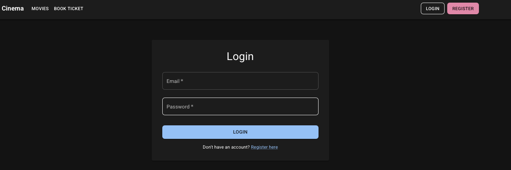
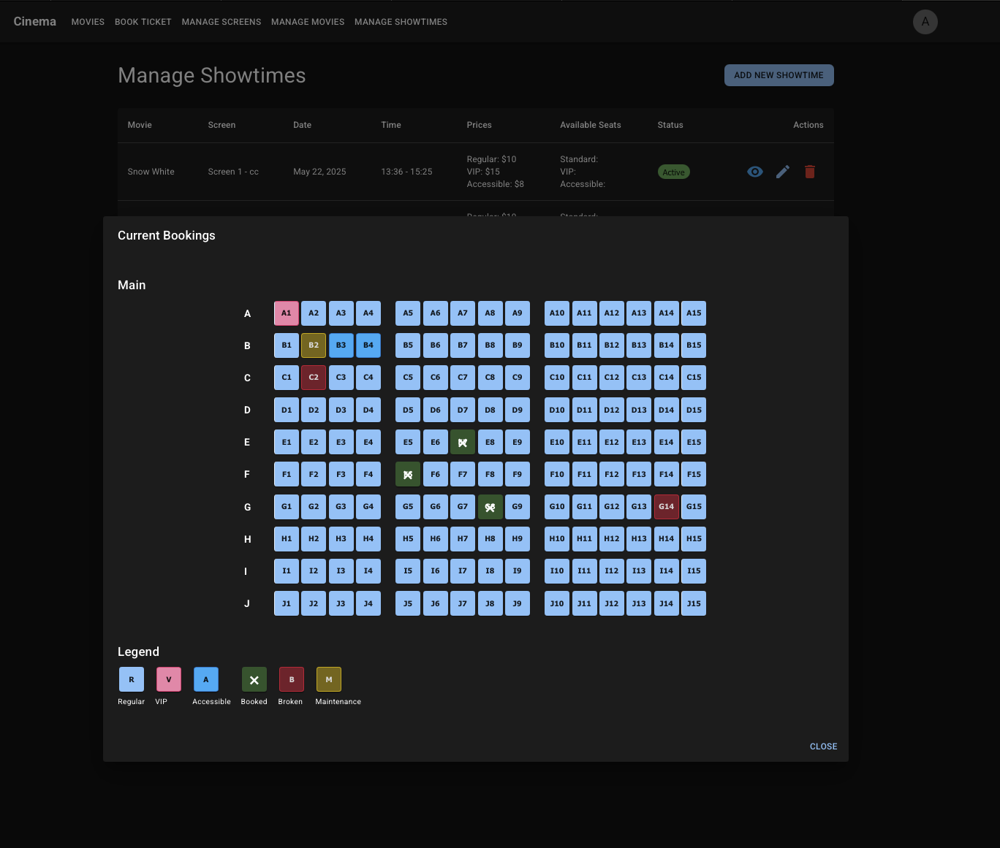

# Cinema Seating System

A modern cinema booking system with real-time movie data from TMDB API and MongoDB database.

## System Demo

### 1. Movie Listing and Homepage

*Homepage showcasing the latest movies with a dynamic grid layout. Features include:*
- Real-time movie data integration with TMDB API
- Responsive grid layout for optimal viewing
- Quick access to movie details and booking options

### 2. Showtime Selection Interface

*Intuitive showtime selection screen allowing users to:*
- View available showtimes for selected movies
- Select preferred screening dates
- See screen information and seat availability

### 3. Interactive Seat Selection

*Advanced seat selection interface featuring:*
- Real-time seat availability updates
- Interactive seat map with color-coded status
- Different seat types (Regular, VIP, Accessible)

### 4. Admin Dashboard

*Comprehensive admin control panel providing:*
- Overview of current bookings and revenue
- Movie and showtime management
- User activity monitoring

### 5. Screen Configuration

*Screen management interface enabling:*
- Custom screen layout configuration
- Seat type and pricing management
- Maintenance status updates

### 6. Booking Management

*Detailed booking management system with:*
- Real-time booking status updates
- Transaction history
- Customer information tracking

### 7. User Profile Management

*User profile interface featuring:*
- Personal information management
- Booking history view
- Preference settings

### 8. Digital Ticket Display

*Digital ticket interface showing:*
- QR code for easy check-in
- Booking details and seat information
- Movie and showtime information

### 9. Payment Processing

*Secure payment interface with:*
- Multiple payment method options
- Secure transaction processing
- Booking summary

## Prerequisites

- Node.js (v18 or higher)
- npm (comes with Node.js)
- MongoDB (local or MongoDB Atlas)

## Project Setup

### 1. Clone the Repository

```bash
git clone <repository-url>
cd cinema-seating-system
```

### 2. Install Dependencies

Navigate to `backend` and `web` folders separately and install dependencies:

```bash
# Install backend dependencies
cd backend
npm install

# Install frontend dependencies
cd ../web
npm install
```

### 3. Environment Configuration

Create a `.env` file in the backend directory with:

```env
# Server Configuration
PORT=3001
NODE_ENV=development

# TMDB API Configuration
TMDB_API_KEY=your_tmdb_api_key

# MongoDB Configuration
MONGODB_URI=your_mongodb_connection_string
```

### 4. Running the Application

#### Backend Development Mode
```bash
cd backend
npm run dev
```

#### Frontend Development Mode
```bash
cd web
npm run dev
```

## Project Structure

```
├── backend/
│   ├── src/
│   │   ├── config/         # Configuration files
│   │   ├── controllers/    # Route controllers
│   │   ├── routes/        # API routes
│   │   ├── models/        # MongoDB models
│   │   └── server.ts      # Main server file
│   ├── .env              # Environment variables
│   └── package.json      # Backend dependencies
│
└── web/                  # Frontend application
```

## API Endpoints

### Movies
- `GET /api/health` - Health check endpoint
- `GET /api/tmdb` - Fetch movies from TMDB API

## Environment Variables Reference

| Variable        | Description           | Default     |
|----------------|-----------------------|-------------|
| PORT           | Server port           | 3001        |
| TMDB_API_KEY   | TMDB API key         | (required)  |
| MONGODB_URI    | MongoDB connection URL| (required)  |
| NODE_ENV       | Environment          | development |